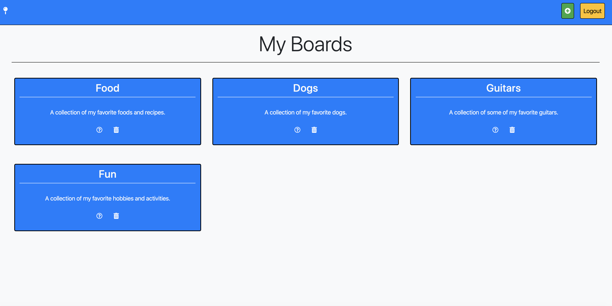
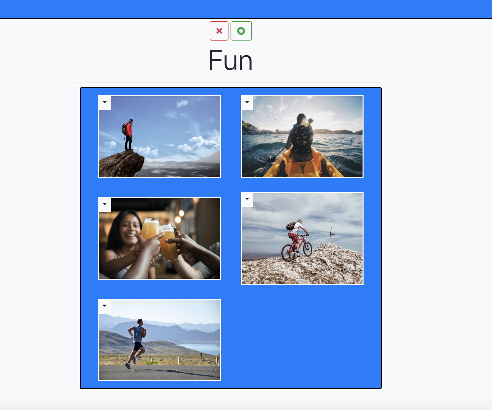
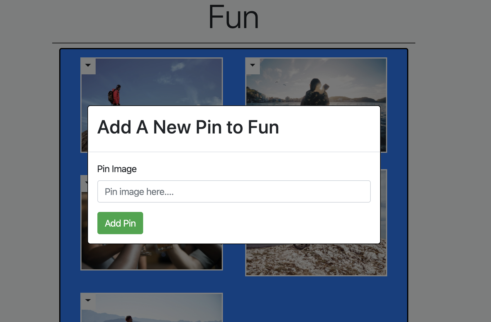
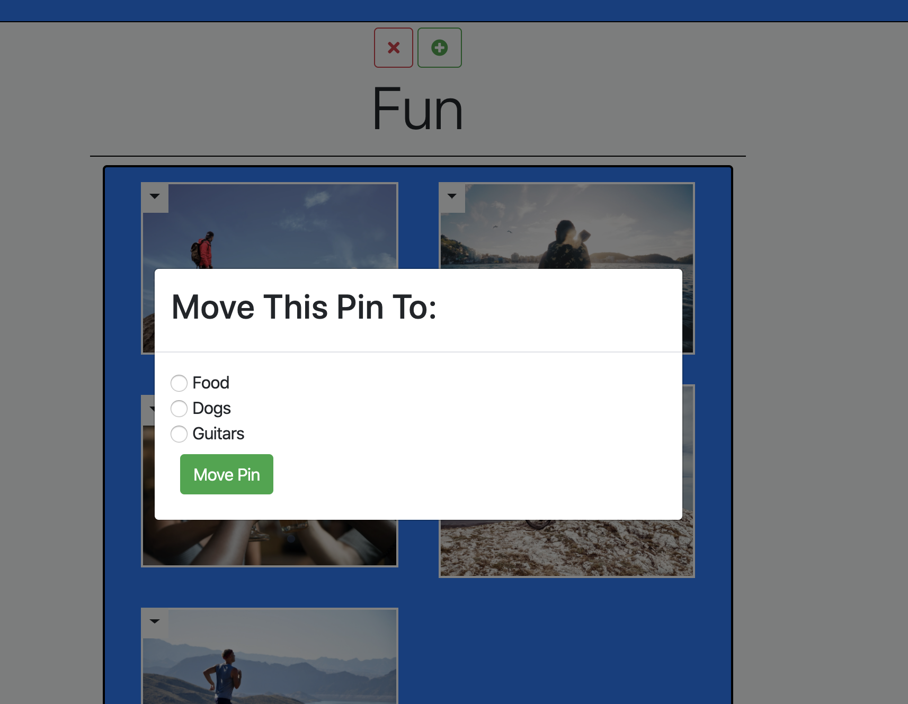

# pinterest

## Description
This project is an imitation of Pinterest and serves as an exercise of full CRUD.  Just like real Pinterest, this project allows an authenticated user to add his or her own boards.  The user will ideally name these boards according to a specific theme and then include a short description of that theme.  On these boards, a user can also add a collection of pins related to the theme of the board.  In the context of this project, pins only consist of images.  The user can add and delete any pin at will, and can also delete any board of their choosing.  Deleting a board will wipe out all the pins on that board.  The user is also able to move a pin from one board to any other board.  This project is made using HTML, SASS, vanilla JS Modules, JQuery, Bootstrap, Webpack, and uses Firebase for realtime database and hosting services.
## Screenshots

## How To Run
[Deployed Link](https://pinterest-d5c39.firebaseapp.com/)

To run locally:
1. Clone down this repository.
2. Navigate to the repository and open the command line.
2. Run `npm install` in the command line.
3. Ater completion, run `npm start`.